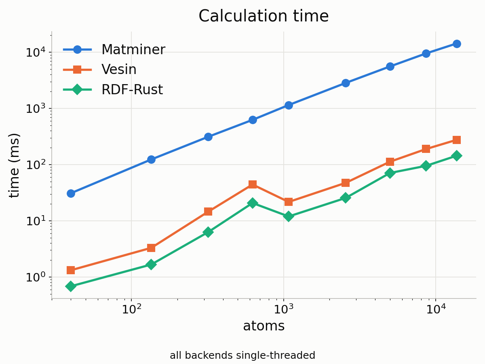
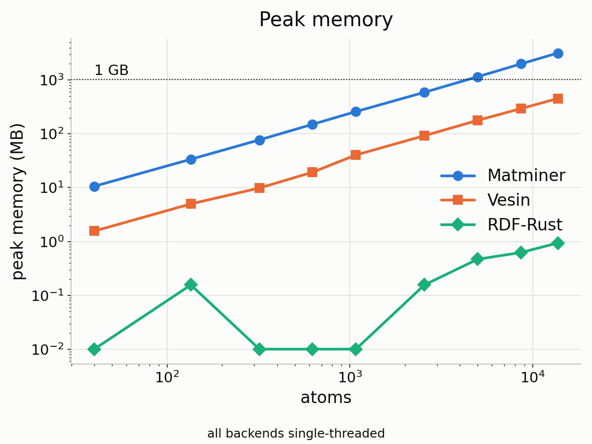
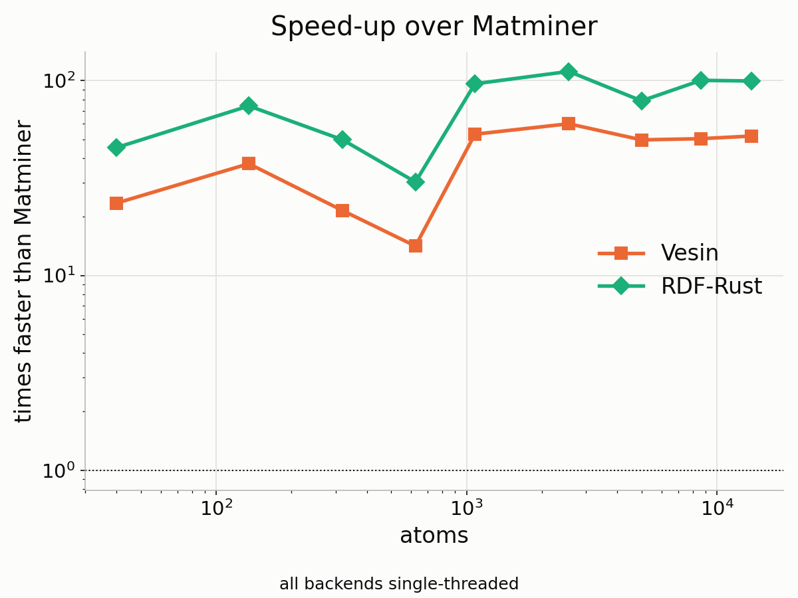
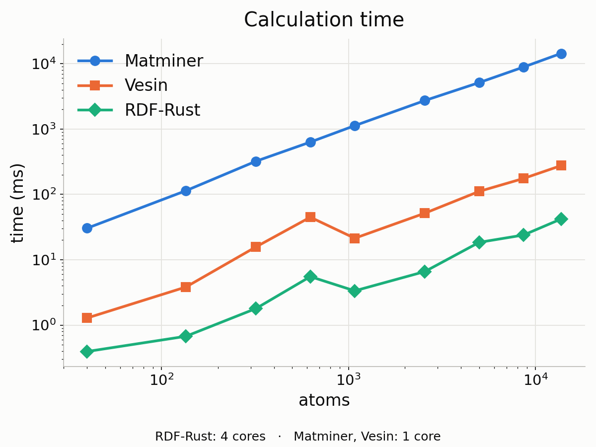
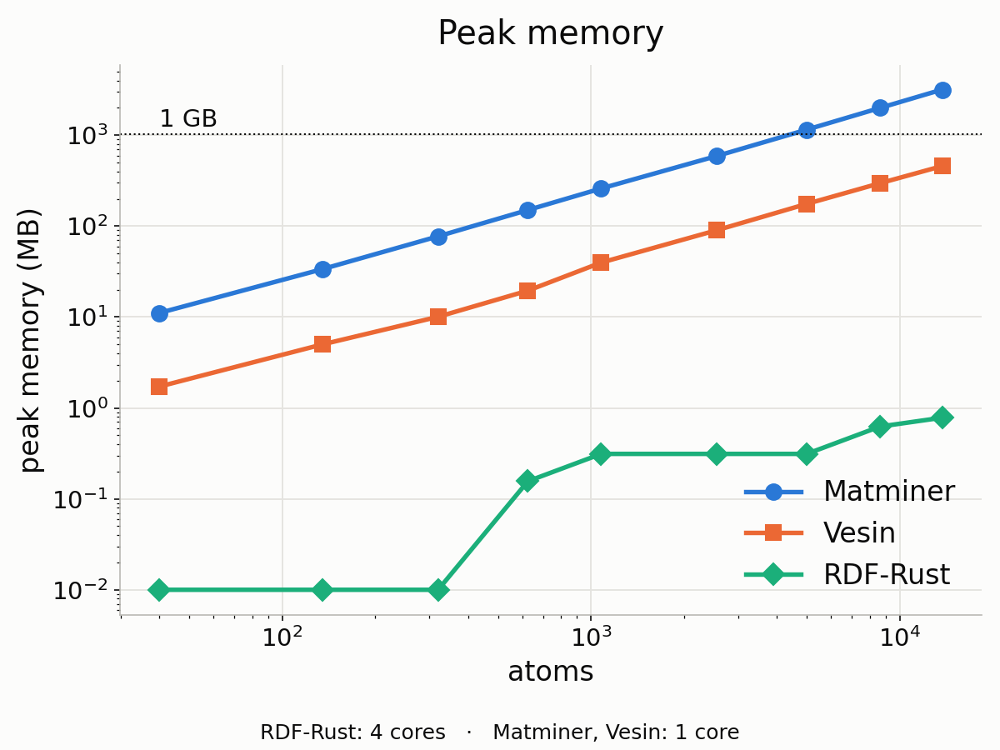
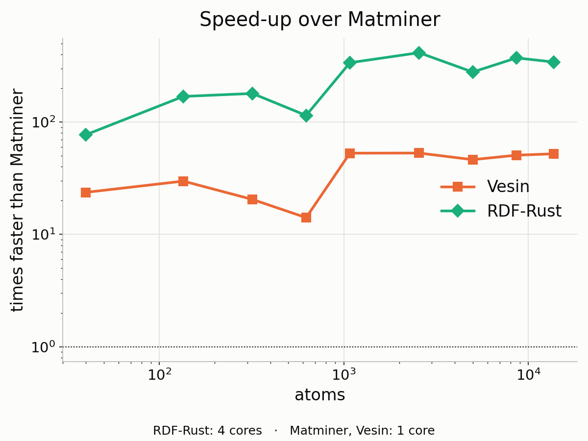

# Benchmarks

Linux x86_64. Cutoff 10 Å, bin 0.1 Å throughout. RDF-Rust is measured on
**1 thread** and on **4 threads**; Matminer and Vesin are single-threaded.

```bash
python benchmarks/make_structures.py                # 24 structures + index.json
python benchmarks/compare_methods.py --threads 1    # all three, *_t1.png / .csv
python benchmarks/compare_methods.py --threads 4    # all three, *_t4.png / .csv
python benchmarks/compare_threads.py                # threads_*.png / .csv
python benchmarks/compare_methods.py --threads 1 --plot   # re-plot, no re-measuring
```

Every timing runs in its own subprocess. glibc keeps freed pages mapped, so a
second in-process reading of the same backend comes out far too low — the same
matminer call measured 722 MB, then 356 MB, then 331 MB. `tracemalloc` is no
use either: it only sees the Python heap, reporting RDF-Rust as 0.0 MB and
missing most of Vesin's.

## The structure set

A perfect crystal is a poor benchmark on its own, so the set has three groups.

| group | what | why |
|---|---|---|
| **size** | SrTiO₃ at 9 sizes, 40 → 13,720 atoms | the scaling curves |
| **variety** | 7 prototypes at ~2,000 atoms | different density, coordination, cell shape and element count |
| **md** | Cu (a = 3.600 Å) and SrTiO₃ (a = 3.900 Å) at σ = 0 → 0.50 Å RMS | what an MD snapshot looks like, and the commensurate case where bin-edge ties appear |

The variety group is Cu FCC, Fe BCC, Si diamond, Ti HCP, NaCl rocksalt,
SrTiO₃ perovskite and a CoCrFeMnNi high-entropy alloy — densities from 0.045 to
0.087 atoms/ų, one to five elements, cubic through hexagonal. The HEA is the
stress case for the histogram, since five elements mean 25 partials.

Positions come from a seeded generator, so the set regenerates identically.

## Scaling

### 1 thread





### 4 threads





**Memory is what runs out first.** Matminer holds every pair distance in a
Python list (~660 bytes per pair) and Vesin in NumPy arrays (~97 bytes per
pair), so both grow linearly with the pair count. RDF-Rust streams pairs from
the cell list into a per-thread histogram and discards them, so its footprint
is the histogram plus the cell list — independent of size. At 13,720 atoms
matminer needs 3.2 GB, which is the practical ceiling on an ordinary machine
long before the runtime is.

**Read the speed-up honestly.** Against matminer the gap is algorithmic: its
inner loop appends every pair distance to a Python list one at a time. Against
Vesin — already a fast C++ neighbour list with vectorised NumPy histogramming —
the 1-thread run is the fair comparison: RDF-Rust is **1.5–2.2× faster** core
for core. The 4-thread run shows what the parallel histogramming adds on top.

## Thread count

The size series with RDF-Rust pinned to 1 and to 4 threads. Matminer and
Vesin are single-threaded in every run.

| atoms | RDF-Rust, 1 thread | RDF-Rust, 4 threads | 4 vs 1 | Vesin (1 core) |
|------:|-------------------:|--------------------:|-------:|---------------:|
| 320 | 6.3 ms | 1.8 ms | 3.5× | 14.6 ms |
| 2,560 | 25.5 ms | 6.6 ms | 3.9× | 47.3 ms |
| 13,720 | 143.9 ms | 42.0 ms | 3.4× | 275.8 ms |

- **Core for core, RDF-Rust is 1.5–2.2× faster than Vesin.** That is the
  algorithmic margin.
- **The 1-thread run is serial.** Measured on 13,720 atoms: CPU time / wall
  time is 1.09 on 1 thread (one core busy) and 4.26 on 4 threads. Total CPU
  work is the same either way (152 vs 157 ms), so the parallel run does the
  same work, split across cores.
- **4 threads scale almost ideally:** 3.4–4.0× from about 300 atoms upward.
  Below that a cell does not give each thread enough work to cover the cost of
  splitting it and merging the per-thread histograms.

## Across structure types

Per-prototype times and peak memory, for RDF-Rust on 1 and on 4 threads, are in
`types_time_t1.csv`, `types_time_t4.csv`, `types_memory_t1.csv` and
`types_memory_t4.csv`.

## Thermal disorder

A perfect crystal can be the *hard* case for an RDF, but only under a condition
that is easy to miss: the lattice spacing has to be **commensurate with the bin
width**. At a = 3.600 Å with 0.1 Å bins the neighbour distances are exact
multiples of an edge, and the last few ulp then decide which of two
neighbouring bins each count falls into — two independently written neighbour
searches disagree on those bins while conserving the total exactly. At the true
a = 3.615 Å of copper the same lattice produces **zero** ties, because 36.15 is
not an integer.

That is worth stating plainly: it is not "perfect crystals are hard", it is
"round lattice constants with round bin sizes are hard". The combination is
easy to hit, since people type both.

The MD group therefore uses deliberately round constants (Cu at 3.600 Å,
SrTiO₃ at 3.900 Å) so the effect is actually visible, with σ = 0 as the
reference. Gaussian displacements remove the degeneracy and the backends then
agree to double precision; the numbers are in `md_ties.csv` and
`md_agreement.csv`.

This is asserted in `tests/test_benchmark_structures.py`: the commensurate
σ = 0 cell must show ties, the heavily rattled one must show none, and the
incommensurate Cu at its true 3.615 Å must show none either.

## Disordered structures

Not a like-for-like comparison, and that is the point: matminer and Vesin need
an ordered structure, so a disordered cell must be expanded into a random
supercell first (timings include that). RDF-Rust weights by occupancy and works
on the original cell.

| input | expanded to | expansion | Matminer | Vesin | RDF-Rust, 1 thread | RDF-Rust, 4 threads |
|---|---:|---:|---:|---:|---:|---:|
| Ba₀.₅Sr₀.₅TiO₃, 5 sites | 320 | 0.003 s | 0.305 s | 0.015 s | **0.0002 s** | **0.0002 s** |
| Ba₁ᐟ₃Sr₂ᐟ₃TiO₃, 5 sites | 1,080 | 0.011 s | 1.205 s | 0.030 s | **0.0002 s** | **0.0002 s** |

On a 5-site cell there is almost nothing to split, so 4 threads change nothing.

It is also the more accurate route: the expanded structure rounds the
occupancies to whatever the supercell allows and commits to one arrangement.

## Agreement

`benchmarks/compare_curves.py` draws the curves and residuals if you want to
see them.

- **Ordered structures:** RDF-Rust matches matminer to **3.6 × 10⁻¹⁵** on every
  pair at every size — double-precision noise. Vesin matches exactly.
- **Disordered structures:** the occupancy-weighted curve lies on the mean of
  400 explicitly sampled random supercells.

Verified across cubic, hexagonal, triclinic, strongly sheared (γ = 150°) and
slab-like cells, cutoffs from 2 to 20 Å and bin sizes from 0.01 to 1.0 Å.

### Two deliberate differences from matminer

1. **Bin-edge ties**, described above. Counts are conserved; only the split
   between two adjacent bins moves.

2. **matminer's normalisation of single-element diatomic cells.** matminer
   divides g_AB by `to_reduced_dict[A] * num_sites`. pymatgen reduces a
   pure-oxygen formula to O₂, so that product is `2·N_O` instead of `N_O` and
   matminer's g_OO comes out **half** its proper value. The same applies to
   cells of pure N, H, F, Cl, Br or I. RDF-Rust and Vesin both count atoms
   directly and agree with each other; matminer is the outlier. Ordinary
   multi-element compositions are unaffected — verified for SrTiO₃, Fe₂O₃,
   TiO₂, Al₂O₃, NaCl, H₂O and CH₄.

## Citing the backends compared here

- **Vesin** (part of the metatensor/metatomic stack) —
  Bigi, F.; Abbott, J. W.; *et al.* *metatensor and metatomic: Foundational
  libraries for interoperable atomistic machine learning.*
  **J. Chem. Phys.** 2026, **164** (6), 064113.
  [doi:10.1063/5.0304911](https://doi.org/10.1063/5.0304911)
- **matminer** —
  Ward, L.; *et al.* *Matminer: An open source toolkit for materials data
  mining.* **Comput. Mater. Sci.** 2018, **152**, 60–69.
  [doi:10.1016/j.commatsci.2018.05.018](https://doi.org/10.1016/j.commatsci.2018.05.018)

## Data behind the figures

Every figure is written together with its numbers, so the curves can be
re-plotted or compared against another machine without re-measuring.

| file | contents |
|---|---|
| `scaling_time_t1.csv`, `_t4.csv` | time in ms per backend, per size |
| `scaling_memory_t1.csv`, `_t4.csv` | peak memory in MB per backend, per size |
| `scaling_speedup_t1.csv`, `_t4.csv` | Vesin and RDF-Rust speed-up over Matminer, per size |
| `types_time_t1.csv`, `_t4.csv`; `types_memory_t1.csv`, `_t4.csv` | per prototype, with atom count, element count, density |
| `md_ties.csv` | distances landing exactly on a bin edge, against displacement |
| `md_agreement.csv` | max relative difference from Matminer, against displacement |
| `all_measurements_t1.csv`, `_t4.csv` | every measurement in one long table |
| `threads_comparison.csv` | RDF-Rust at 1 and 4 threads, with the speed-up and the Vesin reference |
| `results_t1.json`, `results_t4.json` | the raw record, including the agreement check |
